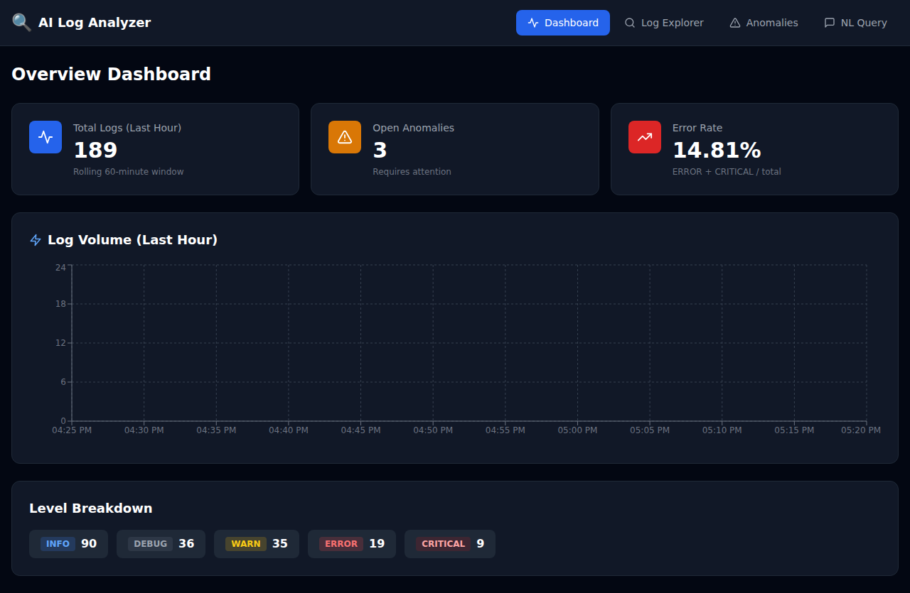
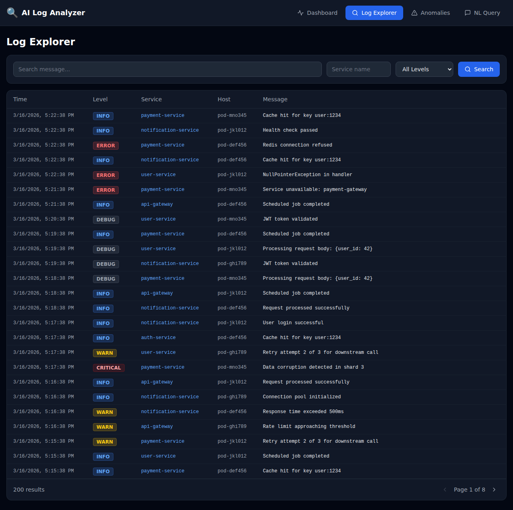
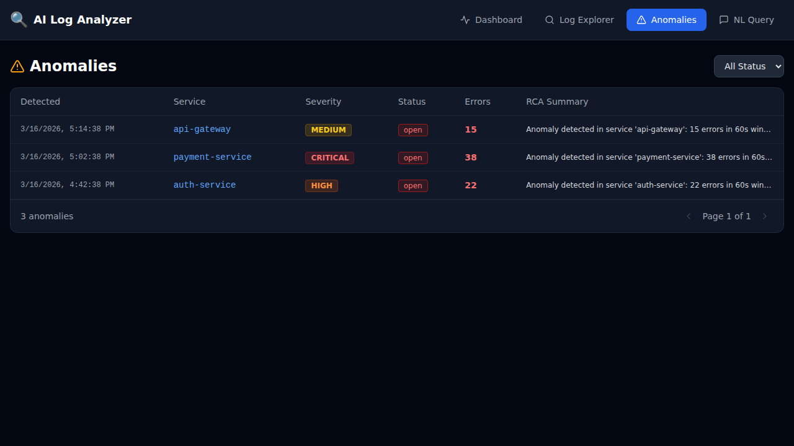
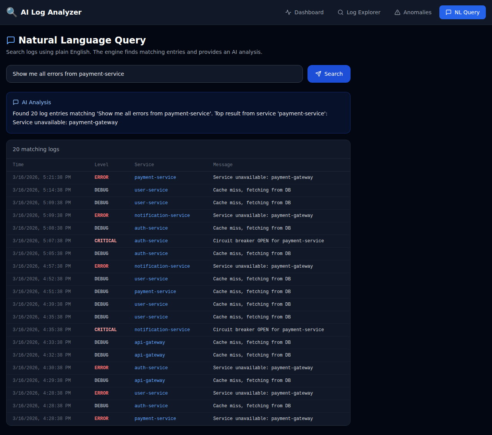

# AI Log Analyzer — AIOps MVP

An event-driven AI-powered log analysis system that ingests logs from multiple sources, detects anomalies, and surfaces insights via a real-time dashboard.

## Screenshots

### Overview Dashboard


### Log Explorer


### Anomalies


### Natural Language Query


---

## Architecture

```
Applications / Services
        │
        ▼
Ingestion Service (FastAPI :8001)
        │  POST /ingest
        ▼
Kafka (raw-logs topic)
        │
        ▼
Processing Service (Consumer)
  ├── Normalizes logs → Elasticsearch (logs index)
  └── Builds 60s feature windows → Elasticsearch (log-features index)
        │
        ▼
AI Engine Service
  ├── Rate-based anomaly detection (threshold configurable)
  ├── RCA Agent (root cause analysis)
  └── Clusterer → Elasticsearch (anomalies index)
        │
        ▼
Alert Service
  └── Slack webhook notifications
        │
        ▼
API Gateway (FastAPI :8000)
  ├── GET /v1/logs
  ├── GET /v1/anomalies
  ├── GET /v1/incidents/{id}
  ├── POST /v1/query  (NL search)
  └── GET /v1/stats
        │
        ▼
Frontend Dashboard (React + Vite + Tailwind :3000)
  ├── Overview Dashboard (stats + log volume chart)
  ├── Log Explorer (search + filter)
  ├── Anomalies (severity badges)
  └── NL Query (natural language log search)
```

---

## Quick Start (Docker Compose)

### Prerequisites
- Docker Engine ≥ 24
- Docker Compose v2

### Start everything

```bash
cd ai-log-analyzer/infra
docker-compose up -d
```

Wait ~60 seconds for Kafka and Elasticsearch to become healthy, then:

| Service       | URL                          |
|---------------|------------------------------|
| Dashboard     | http://localhost:3000        |
| API Gateway   | http://localhost:8000/docs   |
| Ingestion     | http://localhost:8001/docs   |
| Kibana        | http://localhost:5601        |
| Elasticsearch | http://localhost:9200        |
| Qdrant        | http://localhost:6333        |

### Send test logs

```bash
pip install requests
python ai-log-analyzer/scripts/send_test_logs.py --mode batch
# or simulate anomaly traffic:
python ai-log-analyzer/scripts/send_test_logs.py --mode anomaly
# or continuous stream:
python ai-log-analyzer/scripts/send_test_logs.py --mode continuous
```

### Create Elasticsearch indices (manual)

```bash
pip install elasticsearch
python ai-log-analyzer/scripts/create_es_indices.py
```

---

## API Reference

### Ingestion Service (`:8001`)

| Method | Path      | Description                         |
|--------|-----------|-------------------------------------|
| POST   | /ingest   | Ingest single log or batch array    |
| GET    | /health   | Service health                      |

**Log payload:**
```json
{
  "source": "my-app",
  "message": "Database connection failed",
  "level": "ERROR",
  "service": "auth-service",
  "host": "pod-abc123",
  "timestamp": "2024-01-01T12:00:00Z",
  "extra_fields": {"request_id": "xyz"}
}
```

### API Gateway (`:8000`)

| Method | Path                     | Description                      |
|--------|--------------------------|----------------------------------|
| GET    | /v1/logs                 | Query logs (service, level, q)   |
| GET    | /v1/anomalies            | List anomalies                   |
| GET    | /v1/incidents/{id}       | Incident detail                  |
| POST   | /v1/query                | Natural language log search      |
| GET    | /v1/stats                | Dashboard stats                  |
| GET    | /health                  | Service health                   |

---

## Configuration

All services are configured via environment variables. Key variables:

| Variable                  | Default                          | Description                        |
|---------------------------|----------------------------------|------------------------------------|
| KAFKA_BOOTSTRAP_SERVERS   | kafka:29092                      | Kafka broker address               |
| KAFKA_TOPIC               | raw-logs                         | Kafka topic for raw logs           |
| ELASTICSEARCH_URL         | http://elasticsearch:9200        | Elasticsearch endpoint             |
| ANOMALY_ERROR_THRESHOLD   | 10                               | Errors/minute to trigger anomaly   |
| POLL_INTERVAL_SECONDS     | 30                               | AI engine poll interval            |
| SLACK_WEBHOOK_URL         | (empty)                          | Slack webhook for alerts           |

---

## Development Setup

### Backend (Python 3.11+)

```bash
# Install test dependencies
pip install -r ai-log-analyzer/tests/requirements.txt

# Run all tests
cd ai-log-analyzer
python -m pytest tests/ -v
```

### Frontend (Node 20+)

```bash
cd ai-log-analyzer/frontend/dashboard
npm install
npm run dev   # runs on http://localhost:5173
```

---

## Project Structure

```
ai-log-analyzer/
  backend/
    ingestion/    # FastAPI log receiver + Kafka producer
    processing/   # Kafka consumer + log normalizer + feature extractor
    ai_engine/    # Anomaly detector + RCA agent + clusterer
    alerts/       # Alert service (Slack webhook)
    api/          # API gateway (FastAPI)
  frontend/
    dashboard/    # React + Vite + Tailwind dashboard
  infra/
    docker-compose.yml
    k8s/          # Kubernetes manifests
    helm/         # Helm chart stubs
  docs/
  scripts/
  tests/          # Unit tests (pytest)
```

---

## Roadmap

See [AIOPS.md](./AIOPS.md) for the full design document and implementation roadmap.

- **Sprint 0** ✅ Project setup, docker-compose, README
- **Sprint 1** ✅ Ingestion → Kafka → Processing → Elasticsearch + Dashboard
- **Sprint 2** 🔜 Streaming anomaly detection + Slack alerts
- **Sprint 3** 🔜 Vector embeddings (Qdrant) + clustering UI
- **Sprint 4** 🔜 LLM RCA agent (GPT-4 / local model)
- **Sprint 5** 🔜 Plugin interfaces, feature flags, auth, hardening — AI Log Analyzer (AIOps MVP)

An end-to-end **AI-powered log analysis and anomaly detection** platform built for production-grade observability.

## 📦 Repository Structure

```
ai-log-analyzer/
├── backend/
│   ├── ingestion/       # FastAPI log ingestion service → Kafka
│   ├── processing/      # Kafka consumer, normalizer, feature windowing → ES
│   ├── ai_engine/       # Anomaly detection, RCA, clustering
│   ├── alerts/          # Alert dispatcher (Slack + fallback logging)
│   └── api/             # REST API (logs, anomalies, NL query, stats)
├── frontend/
│   └── dashboard/       # React + Vite + Tailwind SPA (4 pages)
├── infra/
│   ├── docker-compose.yml
│   ├── k8s/             # Kubernetes manifests
│   └── helm/            # Helm chart values
├── tests/               # Pytest unit tests
├── scripts/             # Test data generator, ES index creator
└── docs/                # Architecture docs
```

## 🚀 Quick Start (Docker Compose)

```bash
cd ai-log-analyzer/infra
docker compose up -d
```

| Service        | URL                        |
|----------------|----------------------------|
| Frontend       | http://localhost:3000       |
| API            | http://localhost:8000/docs  |
| Ingestion      | http://localhost:8001/docs  |
| Kibana         | http://localhost:5601       |
| Elasticsearch  | http://localhost:9200       |

## 🔄 Data Flow

1. **Ingest** — POST logs to `http://localhost:8001/ingest` (single or batch)
2. **Process** — Kafka consumer normalizes logs → Elasticsearch `logs` index
3. **Feature Windows** — 60s tumbling windows compute per-service error counts
4. **Detect** — AI Engine polls every 30s, flags anomalies above threshold
5. **Alert** — Alert service sends Slack webhooks (or logs to stdout)
6. **Explore** — Frontend dashboard + API provides search, NL query, and stats

## 🧪 Send Test Logs

```bash
# Install requests
pip install requests

# Normal traffic
python scripts/send_test_logs.py --mode normal --count 50

# Trigger an anomaly burst
python scripts/send_test_logs.py --mode anomaly --service payment-service --count 25

# Continuous simulation
python scripts/send_test_logs.py --mode continuous
```

## ✅ Run Tests

```bash
cd ai-log-analyzer
pip install pytest pytest-mock fastapi[testing] httpx pydantic==1.10.15 python-dateutil
python -m pytest tests/ -v
```

## ⚙️ Configuration

| Variable                  | Default                    | Service       |
|---------------------------|----------------------------|---------------|
| `KAFKA_BOOTSTRAP_SERVERS` | `kafka:29092`              | ingestion, processing |
| `ELASTICSEARCH_URL`       | `http://elasticsearch:9200`| all backends  |
| `ANOMALY_ERROR_THRESHOLD` | `10`                       | ai_engine     |
| `POLL_INTERVAL_SECONDS`   | `30`                       | ai_engine, alerts |
| `SLACK_WEBHOOK_URL`       | *(empty = log only)*       | alerts        |

## 📐 Architecture

See [`docs/architecture.md`](ai-log-analyzer/docs/architecture.md) for the full component diagram.